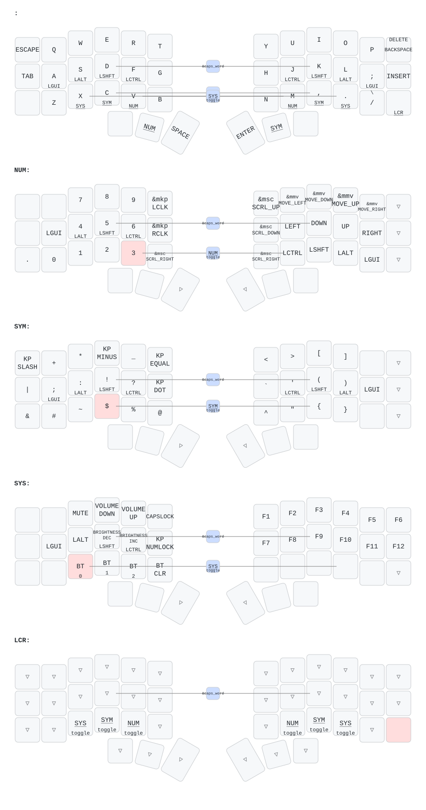

ZMK config for my Corne keyboard

## nice!view art

The right half's display shows one of 30 pieces of 1-bit art by **Hammerbeam**,
picked at random on boot. The left half uses ZMK's stock `nice_view`.

The shield lives in [`boards/shields/nice_view_custom`](boards/shields/nice_view_custom),
vendored from [hammerbeam-slideshow](https://github.com/GPeye/hammerbeam-slideshow)
(MIT). See the README there for what it changes and how to revert it.
